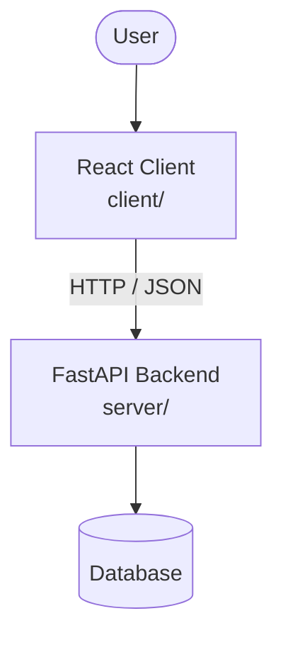

# Architecture

_Auto-generated by the SDLC Assistant from the generated codebase and the approved Feature Spec (latest: NO_SCRUM_ID). Regenerated on each push._

## System Diagram

## Tech Stack
- Not specified

## Backend Modules (server/)
- server/__init__.py
- server/calculator.py
- server/main.py
- server/models.py

## Frontend Modules (client/)
- (no client/ files found yet)

## API Endpoints
- POST /calculate-late-fee

## Data Model
- None
